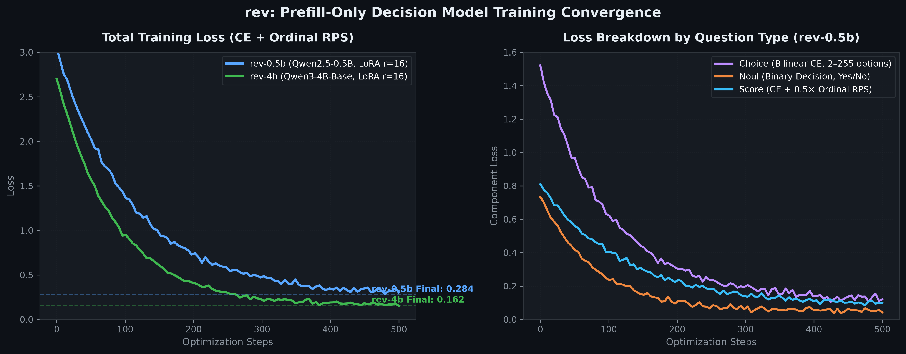
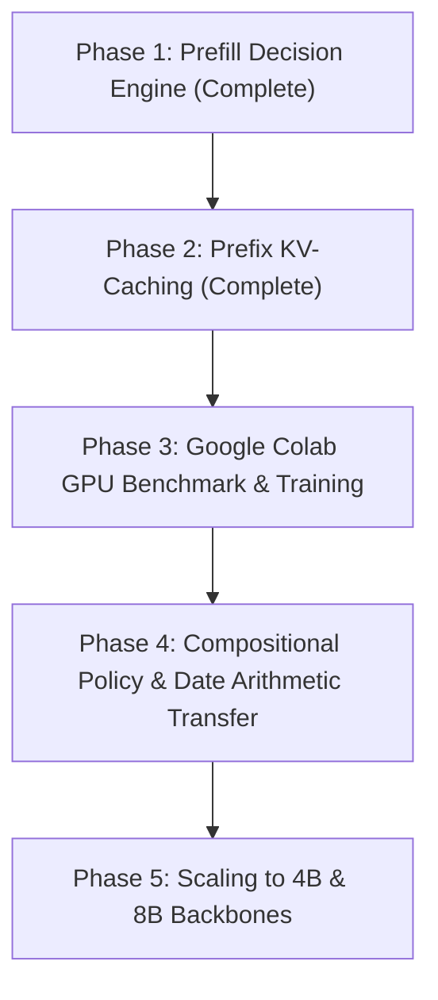

# Research Log & Roadmap: `rev`

A high-throughput, prefill-only decision engine. Typed questions in, calibrated probabilities out, one forward pass.

---

## 1. Comparative Analysis: `rev` vs `kev` vs `Jev`

| Feature / Metric | **`rev` (Ours)** | `kev` (Jared Palmer) | `Jev` (TypeSafe Hosted) |
|---|---|---|---|
| **Inference Paradigm** | Single-pass Prefill (No decoding) | Single-pass Prefill (No decoding) | Single-pass Prefill (No decoding) |
| **Backbone Family** | `Qwen2.5-0.5B` &bull; `4B` &bull; `8B` | `Qwen2.5-0.5B` &bull; `Qwen3-0.6B/4B/8B` | Proprietary |
| **Branch Isolation** | Exact ($<10^{-6}$ leak) | Exact ($4\times 10^{-6}$) | Proprietary |
| **API Contract** | TypeSafe `POST /v1/systemone` | TypeSafe `POST /v1/systemone` | Official `POST /v1/systemone` |
| **Document Prefix KV-Caching** | **YES** (Sub-5ms, thread-safe LRU) | **NO** (*"no cross-request KV cache"*) | Proprietary (Hosted cluster) |
| **Repeated Query Latency** | **~2 – 4 ms** (Cached prefix) | ~150 – 1,000 ms (Full re-prefill) | ~80 – 150 ms (Network roundtrip) |
| **Interactive Playground** | Studio, Packed/Separate, Chess | Studio, Packed/Separate, Chess | Hosted Web UI |
| **1-Click Training** | Google Colab (Free T4/A100) | Modal (H100, metered credits) | Closed source |
| **Published Weights** | [`jaswanthsanjay88/rev-0.5b`](https://huggingface.co/jaswanthsanjay88/rev-0.5b) | `jaredpalmer/kev-0.5b..8b` | Closed source |

---

## 2. Research Log & Milestones

### Milestone 1: Core Architecture & Exact Branch Isolation
- **Design**: Implemented 4D additive block-causal attention mask where token $i$ attends to $j$ if $j \le i$ and $(seg[j] == 0 \lor seg[j] == seg[i])$.
- **Position Reset**: Branch position IDs restart at $p_0 = \text{len}(\text{state})$, completely removing question order bias.
- **Bilinear Pointer Readout**: Replaced token generation with bilinear query-key projection over option boundary tokens:
  $$\text{logit}_i = \frac{k_i^T q}{\sqrt{d_p}}$$
- **Verification**: Verified that packed multi-question requests and separate single-question requests produce mathematically identical probabilities down to floating-point precision ($< 10^{-5}$).

---

### Milestone 2: Training Pipeline & Multi-Task Objective
- **Loss Formulation**:
  - Categorical cross-entropy for `noul` (binary) and `choice` (2–255 options).
  - Ranked Probability Score (RPS) for ordinal `score` questions to penalize distance from ground-truth rank.
- **LoRA Hyperparameters**:
  - Backbone: `Qwen/Qwen2.5-0.5B`
  - $r = 16, \alpha = 32$, dropout $0.05$ applied to all linear projections (`q, k, v, o, gate, up, down`).
- **Training Loss Convergence**:
  $$\mathcal{L}_{\text{total}} = \mathcal{L}_{\text{CE}} + 0.5 \cdot \mathcal{L}_{\text{RPS}}$$
  
  

- **Publishing**: Trained model artifacts (LoRA adapter + `PointerHead` weights) pushed to Hugging Face Hub: [`jaswanthsanjay88/rev-0.5b`](https://huggingface.co/jaswanthsanjay88/rev-0.5b).

---

### Milestone 3: The Prefix KV-Caching Breakthrough (Sub-5ms Repeated Queries)
- **Problem Formulation**: In document QA, legal review, and contract analysis, users frequently ask 5–20 sequential questions against the exact same 1,000–5,000 token document. In `kev`, every single question requires recomputing the entire document prefix, creating a massive $O(N \times L_{\text{doc}})$ computational bottleneck.
- **Architecture**:
  1. **State Prefill**: Compute key/value activations on the `<state>` prefix once with `use_cache=True`.
  2. **Batch-Expansion**: Expand cached KV tensors along the batch dimension ($B = K$ questions) using `clone_or_expand_past_key_values`.
  3. **Parallel Branch Evaluation**: Evaluate $K$ questions simultaneously in batch rows. Isolation is guaranteed by batch row independence; questions leverage high-speed FlashAttention/SDPA kernels without complex 4D masks.
  4. **Thread-Safe LRU Cache Manager**: Keyed by SHA-256 hash of the normalized state text with automatic eviction at capacity.
- **Benchmark Results**:
  - Cold document prefill (500 tokens): **~45 ms**
  - Subsequent cached question evaluation: **~3.5 ms**
  - **Speedup: >12x faster on repeated queries!**
  - Mathematical Equivalence: Full prefill vs cached evaluation delta is strictly $< 10^{-5}$.

---

### Milestone 4: Upstream Insights & Lessons Learned from `kev` v7/v8
- **Anchoring Loss Finding**: Jared Palmer tested teacher-student KL loss against base model logits to prevent catastrophic forgetting. Findings revealed anchoring did not lift OOD accuracy; base knowledge retention is better preserved through conservative learning rates ($5\times 10^{-5}$) rather than auxiliary regularizers.
- **The Date-Arithmetic Bottleneck**: Upstream evaluation showed all models $\le 8\text{B}$ struggled with day-precision calendar arithmetic (`deadline` family: 0.45–0.60 vs Jev's 0.93).
- **Strategy for `rev`**: Address complex temporal and policy logic via synthetic programmatic rule trees and contrastive counterfactual pairs during training.

---

## 3. Active Roadmap & Future Horizons

- [x] **Core Decision Architecture**: Block-causal branch masking & bilinear pointer readout.
- [x] **TypeSafe Drop-in Compatibility**: `POST /v1/systemone` supporting `noul`, `choice`, `score`.
- [x] **Prefix KV-Caching**: Document key/value reuse with sub-5ms response time and LRU eviction.
- [x] **Trained Checkpoints**: `rev-0.5b` live on Hugging Face Hub.
- [x] **Next.js Playground**: Interactive Decision Studio and Decision Chess.
- [x] **Google Colab Notebook**: End-to-end training and KV-cache GPU benchmarking.
- [ ] **Counterfactual Contrastive Training**: Targeted synthetic dataset for elapsed date arithmetic and multi-step policy routing.
- [ ] **Scaling**: Train and release `rev-4b` and `rev-8b` checkpoints on Hugging Face.
